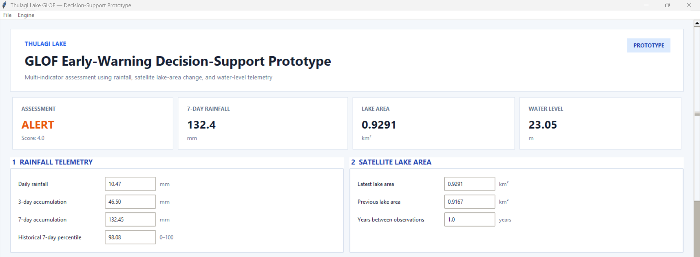
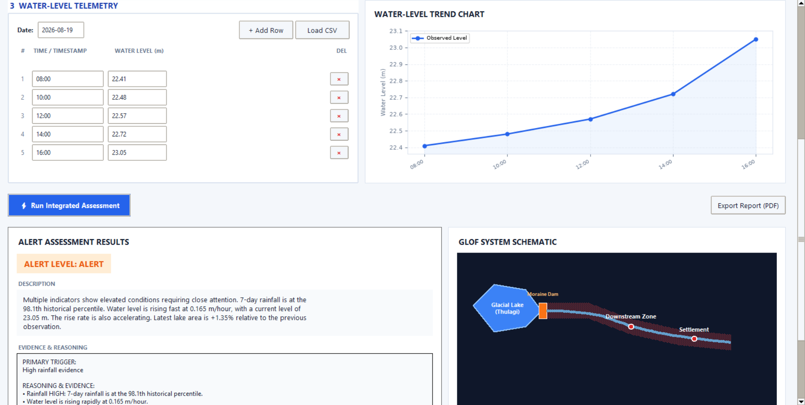

# Thulagi Lake GLOF Early-Warning Decision-Support Prototype

A Python- and GIS-based research prototype for multi-indicator monitoring and
decision support for potential Glacial Lake Outburst Flood (GLOF) conditions
at Thulagi Lake, Nepal.

The prototype integrates **satellite-derived lake-area observations,
historical rainfall analysis, water-level telemetry, downstream hydrological
analysis, and exposure screening** into a single decision-support workflow.

> **Status: Research & Decision-Support Prototype**
>
> This project is a technical and research prototype, not an operational
> early-warning system. The NORMAL, WATCH, and ALERT classifications are
> demonstrative decision-support outputs and are not official warnings.

---

## Dashboard Preview

### Main Monitoring Interface



### Decision-Support Output



---

## Project Overview

Glacial Lake Outburst Floods are high-impact hazards in the Himalayan region.
Early-warning approaches benefit from combining multiple environmental
indicators rather than relying on a single measurement.

This project develops a prototype monitoring and decision-support workflow for
**Thulagi Lake in the Marsyangdi River Basin, Nepal**.

The system combines:

- Sentinel-2 satellite observations
- MNDWI-based lake-water extraction
- Multi-temporal lake-area analysis
- Historical rainfall analysis
- Timestamped water-level telemetry
- Automatic water-level rate calculation
- Automatic water-level trend detection
- Water-level acceleration analysis
- DEM-based downstream drainage tracing
- Potential impact-corridor analysis
- OpenStreetMap-based exposure screening
- Multi-indicator decision logic
- Python-based desktop visualization and reporting

The objective is to demonstrate how **remote sensing, GIS, hydrological
analysis, environmental time-series analysis, and Python programming** can be
combined into a reproducible GLOF decision-support workflow.

---

# System Architecture

```text
                    SATELLITE MONITORING
                           │
                           ▼
                  Sentinel-2 Imagery
                           │
                           ▼
                     MNDWI Analysis
                           │
                           ▼
                  Lake-Water Extraction
                           │
                           ▼
                   Lake-Area Time Series
                           │
                           │
                           ├───────────────────┐
                           │                   │
                           ▼                   ▼
                    RAINFALL DATA       WATER-LEVEL DATA
                           │                   │
                           ▼                   ▼
                  Rainfall Indicators   Telemetry Processing
                           │                   │
                           │          ┌────────┼────────┐
                           │          ▼        ▼        ▼
                           │        Level    Rate     Trend
                           │                   │
                           │                   ▼
                           │             Acceleration
                           │                   │
                           └──────────┬────────┘
                                      ▼
                           MULTI-INDICATOR
                             ALERT ENGINE
                                      │
                                      ▼
                              NORMAL / WATCH /
                                  ALERT
                                      │
                                      ▼
                         DECISION-SUPPORT UI


                    SPATIAL HAZARD CONTEXT
                              │
                              ▼
                           DEM Analysis
                              │
                              ▼
                     D8 Flow Direction
                              │
                              ▼
                    Downstream Flow Path
                              │
                              ▼
                  Potential Impact Corridor
                              │
                              ▼
                    Exposure Screening
````

---

# 1. Sentinel-2 Lake Monitoring

Sentinel-2 imagery was processed to identify the Thulagi Lake water surface
using the **Modified Normalized Difference Water Index (MNDWI)**.

Multiple MNDWI thresholds were tested during development.

The selected prototype threshold is:

```text
MNDWI ≥ 0.30
```

### Sentinel-2 Processing

The processed Sentinel-2 products use:

| Parameter                   | Value                 |
| --------------------------- | --------------------- |
| Sensor                      | Sentinel-2            |
| Water extraction index      | MNDWI                 |
| Selected threshold          | ≥ 0.30                |
| Coordinate Reference System | WGS 84 / UTM Zone 45N |
| EPSG                        | 32645                 |
| Spatial resolution          | 10 m                  |

### Locked Lake-Area Dataset

The current prototype uses the following verified lake-area observations:

| Year | Water Pixels | Lake Area (km²) |
| ---: | -----------: | --------------: |
| 2016 |        8,270 |          0.8270 |
| 2018 |        8,627 |          0.8627 |
| 2020 |        8,844 |          0.8844 |
| 2022 |        9,209 |          0.9209 |
| 2024 |        9,167 |          0.9167 |
| 2025 |        9,291 |          0.9291 |

The satellite observations provide **long-term environmental evidence** for
the decision-support workflow.

They are not treated as continuous real-time warning measurements.

---

# 2. Rainfall Monitoring

The rainfall workflow contains **9,355 daily observations** covering the
period from **2001 through 2026**.

The system derives several rainfall indicators from the time series.

### Rainfall indicators

* Daily rainfall
* 3-day accumulated rainfall
* 7-day accumulated rainfall
* Historical 7-day rainfall percentile

The percentile approach compares recent rainfall conditions against the
historical rainfall distribution.

### Current prototype example

The latest complete rainfall observation used during prototype testing was:

| Indicator                   |              Value |
| --------------------------- | -----------------: |
| Daily rainfall              |           10.47 mm |
| 3-day rainfall              |           46.50 mm |
| 7-day rainfall              |          132.45 mm |
| Historical 7-day percentile | 98.08th percentile |
| Prototype rainfall status   |               HIGH |

The rainfall indicators contribute evidence to the multi-indicator decision
engine.

---

# 3. Water-Level Telemetry

Water level is treated as a **real telemetry-type input** rather than a
manually entered rate or trend value.

The application accepts timestamped water-level observations and automatically
derives the relevant dynamic indicators from the time series.

### Input

The fundamental telemetry input is:

```text
Timestamp + Water Level
```

For example:

```text
2026-08-09 08:00, 22.91 m
2026-08-09 09:00, 22.94 m
2026-08-09 10:00, 22.98 m
...
```

The user does **not** need to manually calculate the rate, trend, or
acceleration.

### Automatically derived indicators

The system calculates:

* Current/latest water level
* Water-level change
* Rate of water-level change
* Rising / falling / stable trend
* Water-level acceleration
* Short-period water-level change

Conceptually:

```text
Timestamped Water Levels
          │
          ▼
   Water-Level Difference
          │
          ▼
     Rate of Change
          │
          ▼
         Trend
          │
          ▼
     Acceleration
```

This makes the telemetry workflow suitable for eventual integration with a
real water-level sensor stream.

### Current Demonstration Dataset

The present prototype contains **145 simulated water-level observations** for
testing the telemetry-processing and decision-support workflow.

The demonstration series includes:

| Indicator              | Prototype value |
| ---------------------- | --------------: |
| Starting water level   |         22.41 m |
| Latest water level     |         23.05 m |
| Latest rise rate       |    0.034 m/hour |
| Number of observations |             145 |

The simulated dataset is used for **software testing and demonstration**.
It should not be interpreted as real-time observed lake conditions.

---

# 4. Multi-Indicator Decision Engine

The prototype combines evidence from three primary environmental domains:

```text
Rainfall
   +
Water-Level Behaviour
   +
Lake-Area Evidence
   │
   ▼
Multi-Indicator Decision Engine
   │
   ▼
NORMAL / WATCH / ALERT
```

The decision engine is implemented in:

```text
scripts/alert_engine.py
```

### Evidence categories

#### Rainfall

Rainfall contributes evidence based on recent rainfall conditions and the
historical percentile of accumulated rainfall.

#### Water level

Water-level evidence considers the current level and its dynamic behaviour,
including:

* Rate of rise
* Trend
* Acceleration
* Recent change

#### Lake area

Satellite-derived lake-area observations provide longer-term environmental
context through observed changes in lake surface area.

---

## Prototype Alert States

The system produces three decision-support states:

| State      | Interpretation                                                            |
| ---------- | ------------------------------------------------------------------------- |
| **NORMAL** | Current combined evidence does not indicate elevated prototype concern    |
| **WATCH**  | Multiple indicators provide elevated evidence requiring closer monitoring |
| **ALERT**  | Combined evidence reaches the prototype alert condition                   |

These classifications are **prototype decision states**, not official GLOF
warning levels.

Thresholds require further scientific calibration and validation before any
operational application.

---

# 5. DEM-Based Downstream Analysis

A processed digital elevation model was used to investigate the potential
downstream drainage pathway from Thulagi Lake.

The workflow includes:

1. DEM preprocessing
2. D8 flow-direction analysis
3. Lake pour-point identification
4. Downstream flow-path tracing
5. Drainage-cell analysis
6. Potential impact-corridor generation

### Downstream Flow Path

The current D8 tracing produced a downstream pathway of approximately:

```text
14.16 km
```

The traced path begins from the identified lake outlet/pour-point area and
follows the derived downstream drainage network.

### Potential Impact Corridor

The current spatial screening identified:

```text
29,869 drainage cells
0.662112 km² corridor area
```

The corridor is intended to provide **spatial hazard context** for the
prototype.

> It is not a validated GLOF inundation boundary and does not represent
> predicted flood depth, velocity, or extent.

---

# 6. Exposure Screening

OpenStreetMap-derived spatial data were used to provide contextual information
about downstream features.

The workflow considers features including:

* Buildings
* Roads
* Settlements
* Points of interest
* Other mapped infrastructure

A 1-km screening area was also evaluated around the monitoring area.

The exposure analysis is intended to support future visualization of
potentially affected infrastructure.

It does **not** provide validated flood damage, depth, velocity, or loss
estimates.

---

# 7. Decision-Support Application

The primary desktop interface is implemented using:

* Python
* Tkinter
* Matplotlib

The main application is:

```text
app.py
```

The decision engine is:

```text
scripts/alert_engine.py
```

The application provides:

* Rainfall indicators
* Satellite lake-area observations
* Timestamped water-level input
* Automatic telemetry calculations
* Water-level trend visualization
* Multi-indicator assessment
* Prototype alert classification
* Decision-support explanations
* Report-export functionality

The interface is designed around the principle that **raw telemetry should
be entered as observations while derived indicators are calculated
automatically by the system**.

---

# 8. Streamlit Dashboard

A separate browser-based dashboard is also included.

The dashboard is located at:

```text
scripts/dashboard.py
```

Launch it with:

```bash
streamlit run scripts/dashboard.py
```

The dashboard provides a visual summary of:

* Rainfall conditions
* Water-level indicators
* Lake-area history
* Prototype decision state
* Monitoring-area context

---

# 9. Current Prototype Results

The major components of the project have reached the following development
state:

| Component                          | Status              |
| ---------------------------------- | ------------------- |
| Sentinel-2 lake extraction         | Completed           |
| MNDWI threshold testing            | Completed           |
| MNDWI threshold selection          | Completed           |
| Lake-area time series              | Completed           |
| Historical rainfall processing     | Completed           |
| Rainfall indicators                | Completed           |
| Water-level telemetry workflow     | Implemented         |
| Automatic rate calculation         | Implemented         |
| Automatic trend detection          | Implemented         |
| Water-level acceleration           | Implemented         |
| D8 downstream tracing              | Completed           |
| Potential impact corridor          | Completed           |
| OSM exposure screening             | Completed           |
| Multi-indicator decision engine    | Implemented         |
| Desktop decision-support interface | Implemented         |
| Streamlit dashboard                | Implemented         |
| Operational warning system         | **Not implemented** |

---

# 10. Repository Structure

```text
Thulagi_Lake_GLOF_EWS/
│
├── app.py
│   └── Main desktop decision-support application
│
├── README.md
├── requirements.txt
├── data_dictionary.md
├── project_scenario.md
│
├── config/
│   └── thresholds.csv
│
├── data/
│   ├── dem/
│   ├── rainfall/
│   ├── raw/
│   ├── processed/
│   ├── spatial/
│   └── water_level/
│
├── docs/
│   ├── dashboard_a.png
│   └── dashboard_b.png
│
├── scripts/
│   ├── alert_engine.py
│   ├── analyze_lake_timeseries.py
│   ├── analyze_mndwi.py
│   ├── analyze_rainfall.py
│   ├── analyze_water_level.py
│   ├── apply_s2_mask.py
│   ├── calculate_lake_areas.py
│   ├── clip_hydro_dem.py
│   ├── create_context_map.py
│   ├── create_impact_corridor.py
│   ├── download_rainfall.py
│   ├── download_s2.py
│   ├── extract_exposure.py
│   ├── extract_osm_exposure.py
│   ├── extract_s2.py
│   ├── extract_water.py
│   ├── process_s2_indices.py
│   ├── simulate_water_level.py
│   ├── trace_downstream.py
│   ├── trace_downstream_extended.py
│   └── validation / analysis scripts
│
├── src/
│   ├── alert_engine.py
│   ├── generate_sensor_data.py
│   ├── imerg_ingest.py
│   └── rainfall_processing.py
│
└── GLOF_EWS/
    └── GIS project and spatial outputs
```

Large raw datasets and generated files are excluded from version control where
appropriate through `.gitignore`.

---

# 11. Technology Stack

### Programming & Data Analysis

* Python
* Pandas
* NumPy
* GeoPandas
* Matplotlib

### Application Development

* Tkinter
* Streamlit
* Plotly

### Remote Sensing

* Sentinel-2
* MNDWI
* Raster-based water extraction
* Multi-temporal satellite analysis

### GIS & Spatial Analysis

* ArcGIS Pro
* DEM analysis
* D8 flow-direction analysis
* Downstream drainage tracing
* Spatial buffering
* Exposure screening
* OpenStreetMap data

### Reporting

* ReportLab

### Version Control

* Git
* GitHub

---

# 12. Installation

## Clone the repository

```bash
git clone https://github.com/Rabinamishra/Thulagi_Lake_GLOF_EWS.git
cd Thulagi_Lake_GLOF_EWS
```

## Create a virtual environment

### Windows

```bash
python -m venv .venv
.venv\Scripts\activate
```

### Linux / macOS

```bash
python3 -m venv .venv
source .venv/bin/activate
```

## Install dependencies

```bash
pip install -r requirements.txt
```

---

# 13. Running the Prototype

## Desktop Application

Run:

```bash
python app.py
```

## Streamlit Dashboard

Run:

```bash
streamlit run scripts/dashboard.py
```

---

# 14. Reproducibility

The project is structured so that individual analytical components can be
processed independently.

Examples include:

```text
Sentinel-2
    ↓
MNDWI
    ↓
Water extraction
    ↓
Lake-area calculation
    ↓
Lake-area time series
```

and:

```text
Rainfall observations
    ↓
Time-series processing
    ↓
Daily / 3-day / 7-day indicators
    ↓
Historical percentile
```

and:

```text
Water-level observations
    ↓
Timestamp processing
    ↓
Rate of change
    ↓
Trend
    ↓
Acceleration
```

These outputs are subsequently supplied to the prototype decision engine.

---

# 15. Limitations

This project is a **research and technical prototype**, not an operational
early-warning system.

Important limitations include:

* Water-level telemetry is currently simulated for demonstration and software
  testing.
* Real-time sensor communications are not integrated.
* Satellite observations are periodic rather than continuous.
* The lake-area series contains discrete observations rather than real-time
  measurements.
* Prototype decision thresholds have not been operationally validated.
* No validated hydrodynamic GLOF inundation model is integrated.
* The downstream corridor is not a predicted flood boundary.
* Exposure screening does not provide flood depth, velocity, or damage
  estimates.
* Historical GLOF events have not been used to formally calibrate all
  decision thresholds.
* Sensor uncertainty and communication failures have not been fully modelled.
* Field validation has not been performed for operational deployment.

---

# 16. Prototype vs Operational System

| Capability                        | Current Prototype | Operational Requirement |
| --------------------------------- | ----------------- | ----------------------- |
| Satellite lake monitoring         | Yes               | Yes                     |
| Historical rainfall analysis      | Yes               | Yes                     |
| Water-level processing            | Yes               | Yes                     |
| Automatic telemetry derivatives   | Yes               | Yes                     |
| Multi-indicator decision logic    | Yes               | Yes                     |
| Real-time sensor network          | No                | Required                |
| Operational threshold validation  | No                | Required                |
| Hydrodynamic inundation modelling | No                | Required                |
| Field validation                  | No                | Required                |
| Sensor redundancy                 | No                | Required                |
| Institutional warning protocol    | No                | Required                |
| Emergency communication system    | No                | Required                |

This distinction is intentional: the project demonstrates the **technical
architecture and analytical workflow** without presenting an unvalidated
research prototype as an operational warning system.

---

# 17. Future Development

Potential future development includes:

* Real-time water-level telemetry ingestion
* Automated rainfall ingestion
* Sensor-quality control and missing-data handling
* Improved threshold calibration
* Historical event-based validation
* Hydrodynamic inundation modelling
* Flood-depth and velocity estimation
* Infrastructure exposure visualization
* Interactive hazard maps
* Automated report generation
* Uncertainty analysis
* Sensor redundancy and reliability assessment
* Field validation
* Operational-readiness assessment

---

# 18. Research Relevance

This project demonstrates the integration of:

```text
Remote Sensing
       +
GIS
       +
Hydrological Analysis
       +
Time-Series Analysis
       +
Python Programming
       +
Decision-Support Systems
       │
       ▼
GLOF Monitoring Prototype
```

The workflow is relevant to research and applications involving:

* Glacial hazards
* GLOF risk assessment
* Remote sensing
* GIS
* Hydrology
* Environmental data science
* Natural-hazard monitoring
* Disaster risk reduction
* Geospatial decision-support systems

The project also demonstrates practical integration between **geospatial
analysis and software development**, rather than treating GIS processing and
application development as separate workflows.

---

# 19. Author

**Rabina Mishra**

MSc Geology | GIS & Remote Sensing | Natural Hazard Applications

This project was developed as an independent research and technical prototype
exploring the integration of remote sensing, GIS, environmental time-series
analysis, hydrological reasoning, and Python-based decision-support methods
for GLOF risk monitoring.

---

# Disclaimer

This repository presents a research prototype for demonstrating a
multi-indicator GLOF monitoring and decision-support workflow.

The **NORMAL, WATCH, and ALERT** classifications generated by the prototype
are **not official warnings** and must not be used for emergency decision
making.

Operational deployment would require scientific validation, field
instrumentation, sensor reliability assessment, hydrodynamic modelling,
historical-event validation, uncertainty assessment, institutional
authorization, and integration with an appropriate warning and emergency
response framework.

